---
# Driving School Scheduler Functional Specifications

This repository contains three separate documents in Markdown format:

1. Frontend Functional Specification
2. Backend Functional Specification
3. System Overview for Team Lead

---

# 1. Frontend Functional Specification

## User Types
- Student / Customer
- Instructor
- Admin / School Owner

## Common UI Guidelines
- Responsive web app (mobile + desktop)
- Clean minimal design
- Color-coded calendars: Green = confirmed, Yellow = pending deposit, Gray = canceled
- Alerts via toast/modal
- Input validation (dates, phone, PayID reference)

## Student Features
| Feature | Description | UI Elements |
|---------|------------|------------|
| Account creation | Phone number with OTP | Phone input → OTP modal |
| Booking a lesson | Select lesson type, instructor, date/time | Drop-downs, calendar picker, available slots highlighted |
| PayID Deposit Payment | Show instructions & input field for reference | Static text for PayID, input field, Submit button |
| Lesson confirmation | Confirmed after deposit verified | Status badge |
| Reschedule / Cancel | Student can request reschedule/cancel | Buttons triggering backend + SMS |
| Lesson start OTP | Enter OTP to start lesson | OTP modal |
| SMS Notifications | Booking, deposit, reschedule, OTP | Handled automatically via backend |

## Instructor Features
| Feature | Description | UI Elements |
|---------|------------|------------|
| Instructor Calendar | View assigned lessons | Color-coded calendar, filters |
| Reschedule / Cancel | Request changes | Action buttons + backend triggers SMS |
| Lesson Start Verification | Confirm student presence via OTP | OTP input modal |
| Lesson Summary / History | Completed lessons and notes | Table view, sortable columns |

## Admin / Owner Features
| Feature | Description | UI Elements |
|---------|------------|------------|
| Dashboard Overview | Lessons, pending deposits, utilization | Summary cards |
| Approve Deposits | Verify PayID payments | Pending deposit table, confirm button |
| Analytics | Revenue, peak hours, reschedules | Charts / tables |
| Manage Instructors & Lesson Types | CRUD operations | Forms and table list views |

---
# 2. Backend Functional Specification

## Core Entities / Data Models
| Entity | Key Fields | Notes |
|--------|-----------|-------|
| Student | id, name, phone, OTP_verified, lessons[] | OTP on create + lesson start |
| Instructor | id, name, calendar[], lessons[] | Max hours/week constraint |
| Lesson | id, type_id, instructor_id, student_id, datetime, status, deposit_paid | Tracks lesson progress |
| LessonType | id, name, duration, price | Different lesson types |
| PaymentDeposit | id, lesson_id, amount, status, PayID_ref | Tracks PayID verification |
| SMSNotification | id, lesson_id, type, status, sent_at | Logging notifications |

## APIs
### Student APIs
| Endpoint | Method | Description |
|----------|--------|------------|
| /register | POST | Phone input, send OTP |
| /verify-otp | POST | Verify OTP (account or lesson start) |
| /book-lesson | POST | Lesson_type, instructor, datetime, return deposit instructions |
| /submit-deposit | POST | PayID reference input, triggers verification workflow |
| /reschedule-lesson | POST | Request reschedule, triggers SMS |
| /cancel-lesson | POST | Request cancellation, triggers SMS |
| /lesson-status | GET | Return lesson info |

### Instructor APIs
| Endpoint | Method | Description |
|----------|--------|------------|
| /calendar | GET | Lessons for day/week/month |
| /lesson-start-otp | POST | Confirm OTP input |
| /reschedule-lesson | POST | Request reschedule |
| /cancel-lesson | POST | Request cancel |

### Admin APIs
| Endpoint | Method | Description |
|----------|--------|------------|
| /dashboard | GET | Summary cards and metrics |
| /analytics | GET | Pre-aggregated statistics |
| /verify-deposit | POST | Admin approves PayID payment |
| /manage-instructor | POST/PUT/DELETE | CRUD for instructors |
| /manage-lesson-type | POST/PUT/DELETE | CRUD for lesson types |

## Payment Verification Workflow (Option C)
1. Student submits PayID reference → backend stores `PaymentDeposit.status = pending`
2. Scheduled job queries bank API → match amount + reference
3. If match → `PaymentDeposit.status = confirmed`, lesson marked Confirmed
4. SMS notification sent to student + instructor

## Lesson OTP Flow
1. Instructor starts lesson → backend generates OTP
2. Student enters OTP → backend validates
3. Lesson marked In Progress
4. Optional SMS notification

## SMS Notification Module
- Event-driven: triggers on booking, deposit verified, reschedule/cancel, lesson start OTP
- Logs in `SMSNotification` table

## Analytics / Reporting
- Precompute daily aggregates via cron:
  - Lessons completed per instructor
  - Instructor utilization
  - Revenue
  - Reschedules / cancels
- Expose JSON API for frontend charts

---
# 3. System Overview for Team Lead

## Modules
1. **Frontend**: Student portal, Instructor portal, Admin dashboard (Vue/React, responsive)
2. **Backend**: REST API, Payment verification microservice, OTP generation, SMS service, Analytics aggregator
3. **Database**: Postgres tables (Student, Instructor, Lesson, LessonType, PaymentDeposit, SMSNotification, Audit logs)
4. **Third-party Integrations**: SMS provider, Open Banking/Bank API for PayID, optional Stripe/PayPal fallback

## Event Flow (Lean MVP)

```mermaid
flowchart LR
A[Student books lesson] --> B[Backend: Validate slot]
B --> C[Create Lesson, Pending Deposit]
C --> D[Show PayID Instructions]
D --> E[Student submits reference]
E --> F[Payment Verification Job]
F --> G{Match Found?}
G -- Yes --> H[Mark deposit confirmed]
G -- No --> I[Pending]
H --> J[Send SMS to student + instructor]
J --> K[Lesson confirmed in frontend]
K --> L[Lesson start: OTP generated]
L --> M[Student enters OTP -> verify backend]
M --> N[Lesson marked In Progress]
N --> O[End of Lesson: update analytics]
```

## Lean Design Principles
- Event-driven architecture decouples modules
- Start monolith for MVP, microservices optional later
- Single DB reduces maintenance
- Feature flags / modular code for future features
- Batch jobs for payment verification, analytics, SMS retries

## Phase-wise MVP Roadmap
| Phase | Deliverable |
|-------|------------|
| Phase 1 | Booking, PayID deposit auto-verification, reschedule/cancel, lesson start OTP, SMS, admin dashboard, basic analytics |
| Phase 2 | Pack pricing, instructor metrics, student progress, multi-location support |
| Phase 3 | Advanced analytics, marketing campaigns, SaaS scaling |

